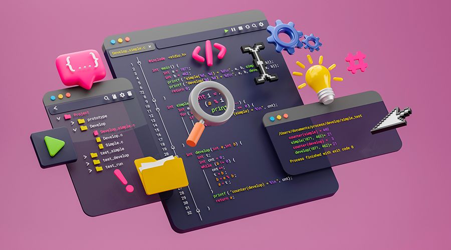

# 💻 Lorena Martín Piñero – Portfolio

Frontend Developer | UX/UI | Web Development

Bienvenido a mi portfolio profesional.  
Aquí encontrarás algunos de los proyectos que he desarrollado durante mi formación y práctica en desarrollo web.

---

## 🌐 Live Portfolio

👉 https://lorenamp25.github.io/PORTFOLIO/

---

## 🚀 Tecnologías

Frontend
- HTML
- CSS
- JavaScript
- React
- Angular
- TypeScript

Backend
- PHP
- MySQL

Diseño
- Figma
- Blender
- Photoshop
- UX/UI

Herramientas
- Git
- GitHub
- Visual Studio Code
- Docker

---

## 📂 Proyectos destacados

### 🎬 Streambox Angular
Aplicación de streaming desarrollada con Angular.

Tecnologías:
- Angular
- TypeScript
- HTML
- CSS

Demo  
https://streambox-angular-943yfwp0g-lorenas-projects-17e1e0a4.vercel.app/

Repositorio  
https://github.com/lorenamp25/Streambox-Angular

---

### 🏥 Hospital Management Angular
Aplicación para gestionar pacientes, doctores y citas.

Tecnologías:
- Angular
- TypeScript
- HTML
- CSS

Demo  
https://hospital-management-angular-l4vy57shl-lorenas-projects-17e1e0a4.vercel.app/

Repositorio  
https://github.com/lorenamp25/hospital-management-angular

---

### 🛒 React Shopping Cart
Aplicación de carrito de compra desarrollada con React.

Tecnologías
- React
- JavaScript
- HTML
- CSS

Demo  
https://react-carrito-compra.vercel.app/

Repositorio  
https://github.com/lorenamp25/react-carrito-compra

---

## 👩‍💻 Sobre mí

Soy desarrolladora Frontend con formación en Desarrollo de Aplicaciones Web (DAW).  
Me interesa especialmente crear interfaces modernas, intuitivas y bien diseñadas.

También tengo formación en:

- UX Design (Google)
- Blender 3D
- Diseño de interfaces

Actualmente busco mi **primera oportunidad profesional como Frontend Developer o UX/UI Designer.**

---

## 📬 Contacto

LinkedIn  
https://www.linkedin.com/in/lorena-mart%C3%ADn-pi%C3%B1ero/

GitHub  
https://github.com/lorenamp25

Email  
lomapi05@gmail.com